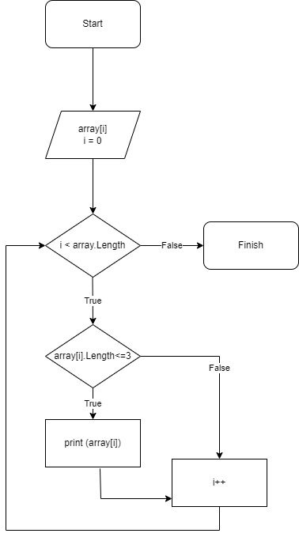

# Description

1. Firstly, repository on GitHub was created.
2. Decision of the task was illustrated by block diagram.
3. In VS Code was made a folder that will contain a program with decision of the task.
4. Block diagram was added to README file (see below).

5. Program and block diagram will be pushed to the GitHub repository.